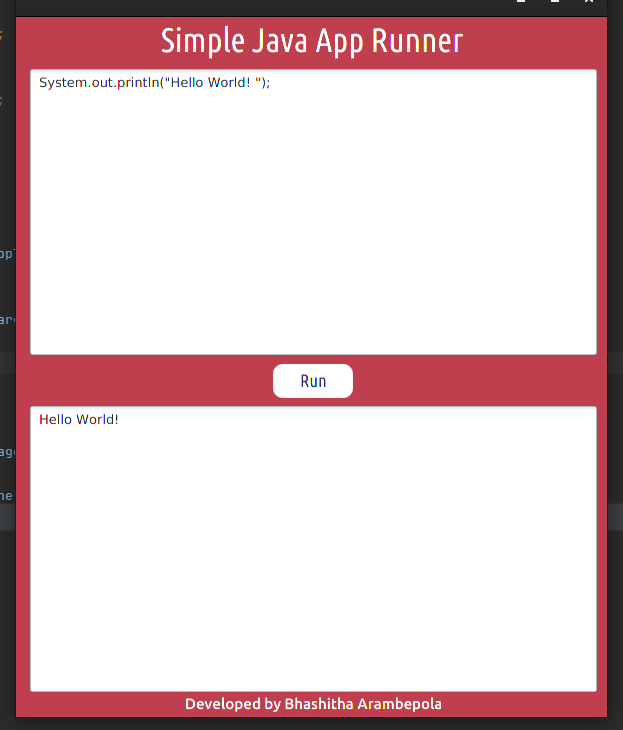
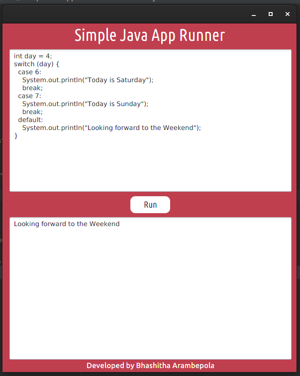
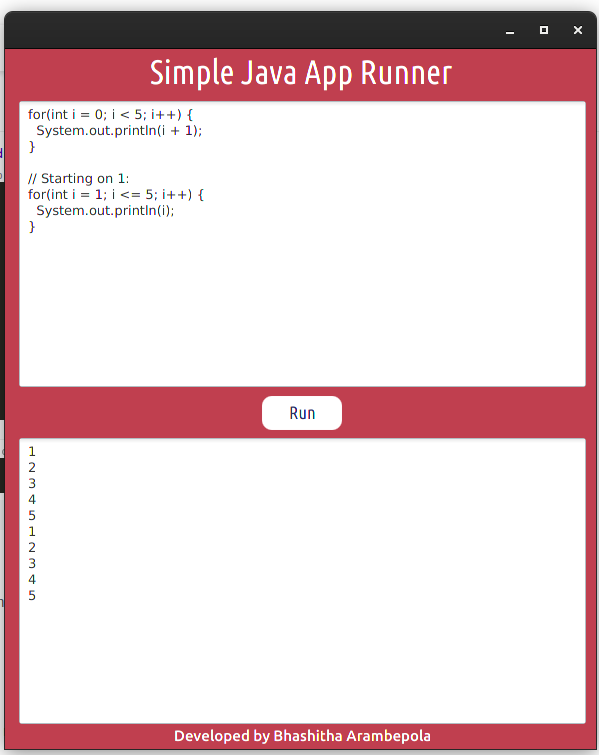

# Simple Java App Runner

## ABOUT THE PROJECT

### Simple Java App Runner is an application that allow users to test simple java codes which can be implemented in the main method. This app is built using Java SE library and Java FX framework.

## SCREENSHOTS

